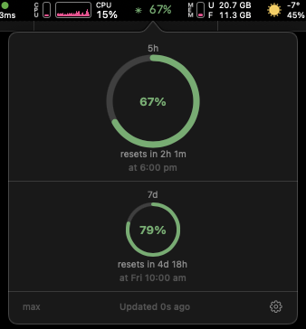
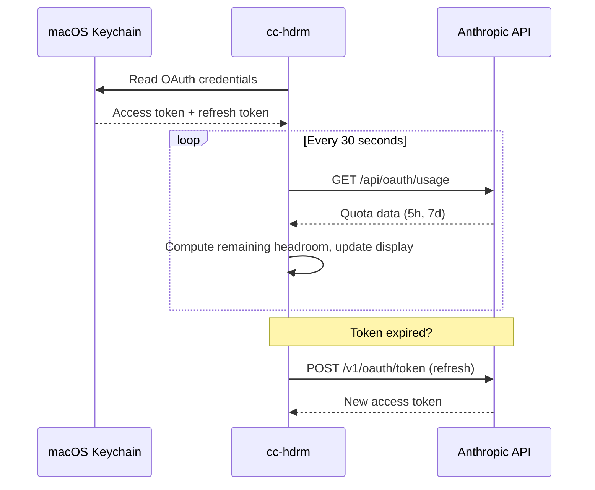

# cc-hdrm

A macOS menu bar utility that shows how much Claude capacity you have left. Built for Claude Pro and Max subscribers who use Claude Code and want to avoid mid-task rate limit surprises.

## What It Does

cc-hdrm sits in your menu bar and shows your remaining headroom — the percentage of your token quota still available in the current window. Click it to see ring gauges for both 5-hour and 7-day windows, reset countdowns, and your subscription tier.

<p align="center">
  
</p>

### Key Features

- **Zero configuration** — reads OAuth credentials directly from macOS Keychain (from your existing Claude Code login)
- **Zero dependencies** — pure Swift/SwiftUI, no third-party libraries
- **Zero tokens spent** — polls the API for quota data, not the chat API
- **Background polling** every 30 seconds with automatic token refresh
- **Color-coded thresholds** — green, yellow, orange, red as headroom drops
- **Data freshness tracking** — clear indicator when data is stale or API is unreachable

## Requirements

- macOS 14.0 (Sonoma) or later
- An active [Claude Pro or Max](https://claude.ai/upgrade) subscription
- [Claude Code](https://docs.anthropic.com/en/docs/claude-code) installed and logged in at least once (this creates the Keychain credentials cc-hdrm reads)

## Install

### Homebrew

```sh
brew install rajish/tap/cc-hdrm
```

### Download

Grab the latest `.dmg` from [GitHub Releases](https://github.com/rajish/cc-hdrm/releases/latest).

### Build from Source

You need [Xcode 16+](https://developer.apple.com/xcode/) and [XcodeGen](https://github.com/yonaskolb/XcodeGen).

```sh
# Install XcodeGen if you don't have it
brew install xcodegen

# Clone and build
git clone https://github.com/rajish/cc-hdrm.git
cd cc-hdrm
xcodegen generate
open cc-hdrm.xcodeproj
```

Then build and run from Xcode (`Cmd+R`).

To build from the command line:

```sh
cd cc-hdrm
xcodegen generate
xcodebuild -project cc-hdrm.xcodeproj -scheme cc-hdrm -configuration Release build
```

## How It Works



cc-hdrm reads the OAuth credentials that Claude Code stores in macOS Keychain. It never stores tokens on disk, never caches them between poll cycles, and never prompts you to log in. If you're logged into Claude Code, cc-hdrm works automatically.

## Versioning

This project follows [Semantic Versioning](https://semver.org/spec/v2.0.0.html) (`major.minor.patch`).

- **Source of truth:** `CFBundleShortVersionString` in `cc-hdrm/Info.plist`
- **Git tags:** `v{major}.{minor}.{patch}` (e.g., `v1.0.0`)
- **Changelog:** [CHANGELOG.md](CHANGELOG.md) follows [Keep a Changelog](https://keepachangelog.com/en/1.1.0/) format with an `[Unreleased]` section for pending changes
- **Release keywords:** Include `[patch]`, `[minor]`, or `[major]` in PR titles to trigger an automated version bump

### Automated Pre-Merge Version Bump

The [`release-prepare.yml`](.github/workflows/release-prepare.yml) GitHub Actions workflow automatically bumps the version when a release keyword is detected in a PR title targeting `master`.

**How it works:**

1. A maintainer opens (or edits) a PR with `[patch]`, `[minor]`, or `[major]` in the title
2. The workflow reads the current version from `master`'s `cc-hdrm/Info.plist`
3. It computes the new semver version and commits the updated `Info.plist` back to the PR branch
4. The commit message is `chore: bump version to {new_version}`

**Trigger events:** `opened`, `edited` (title change), `synchronize` (new push)

**Rules:**
- Only maintainers can trigger version bumps — non-maintainer keywords are ignored with a PR comment
- No keyword = no bump, workflow exits cleanly
- If multiple keywords are present, highest precedence wins: `major` > `minor` > `patch`
- Keywords are case-insensitive (`[Patch]`, `[MINOR]`, etc.)
- The workflow is idempotent — re-runs read the version from the PR's base branch (typically `master`), not the PR branch

### Automated Post-Merge Release

The [`release-publish.yml`](.github/workflows/release-publish.yml) GitHub Actions workflow runs on every push to `master`. When it detects a version bump commit (from the pre-merge workflow above), it automatically builds, packages, and publishes a release.

**Pipeline steps:**

1. Detect the `chore: bump version to {version}` commit in the push
2. Validate the version matches `CFBundleShortVersionString` in `cc-hdrm/Info.plist`
3. Auto-generate a changelog entry from commit messages since the previous tag
4. Update `CHANGELOG.md` and commit to `master`
5. Tag the changelog commit with `v{version}`
6. Build a universal binary (arm64 + x86\_64) via `xcodebuild archive`
7. Package as ZIP (`cc-hdrm-{version}-macos.zip`) and DMG (`cc-hdrm-{version}.dmg`)
8. Compute SHA256 checksums
9. Create a GitHub Release with the changelog entry as body and ZIP/DMG/checksums as assets

**Changelog generation:** Commit messages since the previous tag are collected automatically, excluding automation commits. If the merged PR body contains content between `<!-- release-notes-start -->` and `<!-- release-notes-end -->` markers, that content is prepended as a release summary.

**No version bump = no release.** If a push to `master` doesn't include a version bump commit, the workflow exits cleanly.

## Status

This project is in active development. Core functionality (menu bar headroom display, background polling, token refresh, popover with ring gauges) is implemented and working. Notification support for low-headroom thresholds is planned.

## Contributing

See [CONTRIBUTING.md](CONTRIBUTING.md) for guidelines.

## License

[MIT](LICENSE) — Copyright (c) 2026 Radzisław Galler
