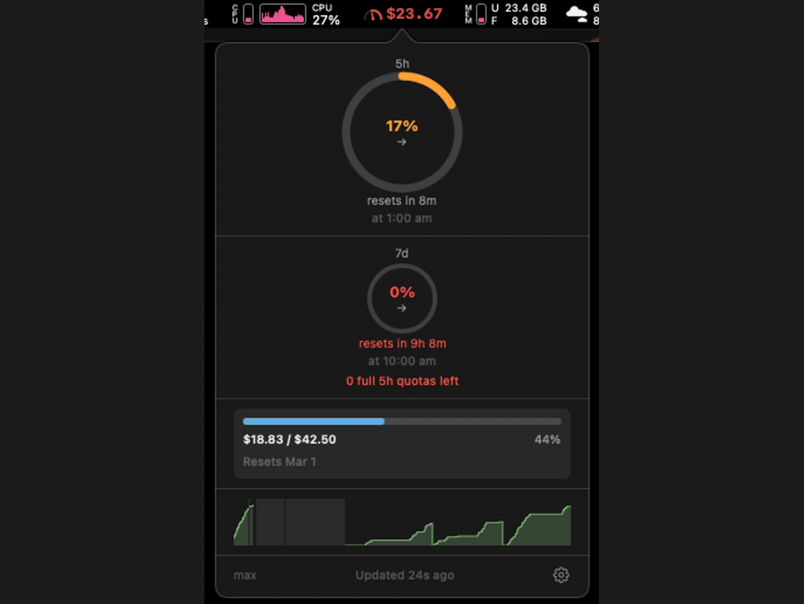
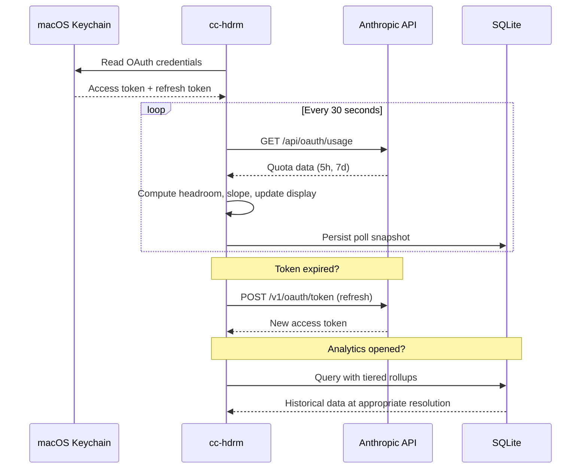

# cc-hdrm

A macOS menu bar utility that shows how much Claude capacity you have left. Built for Claude Pro and Max subscribers who use Claude Code and want to avoid mid-task rate limit surprises.

## What It Does

cc-hdrm sits in your menu bar and shows your remaining headroom — the percentage of your token quota still available in the current window, plus a burn rate indicator so you know how fast you're consuming it. Click to see ring gauges for both 5-hour and 7-day windows, extra usage tracking, a 24-hour sparkline, and reset countdowns. Open the analytics window for historical charts, subscription value breakdown, extra usage tracking, and insights about your usage patterns.

<p align="center">
  
</p>

## Features

### Zero Overhead

- **Zero configuration** — reads OAuth credentials directly from macOS Keychain (from your existing Claude Code login)
- **Zero dependencies** — pure Swift/SwiftUI, no third-party libraries
- **Zero tokens spent** — polls the API for quota data, not the chat API

### Menu Bar

- **Headroom percentage** — always-visible remaining capacity for your active rate-limit window
- **Color-coded severity** — green, yellow, orange, red as headroom drops, with escalating font weight
- **Burn rate indicator** — slope arrows (→ ↗ ⬆) show whether usage is flat, rising, or steep
- **Smart window promotion** — when your 7-day budget can't sustain another full 5-hour cycle, the 7d value promotes to the menu bar with a "7d" label
- **Exhausted countdown** — when headroom hits 0%, switches to a reset countdown (↻ Xm)
- **Extra usage indicator** — when usage exceeds plan limits, shows remaining prepaid balance (e.g., `$12.50`) or amount spent

### Popover

- **Ring gauges** — 5-hour (primary) and 7-day (secondary) headroom with animated fill, percentage, and slope indicators
- **Reset countdowns** — relative ("resets in 2h 13m") and absolute ("at 4:52 PM") for both windows
- **7d quotas remaining** — shows how many full 5-hour cycles your weekly budget can still sustain
- **Extra usage bar** — if extra usage is enabled on your account, shows dollar-based spend vs. limit (`$19.08 / $42.50`) with a color-coded progress bar and billing cycle reset date; hidden otherwise
- **24-hour sparkline** — step-area chart of recent usage with visible reset drops and gap rendering; click to open analytics
- **Data freshness** — "updated Xs ago" indicator; amber warning when stale, full status message when very stale
- **Subscription tier** — your Claude plan displayed in the footer
- **Gear menu** — settings and quit

### Analytics Window

- **Floating utility panel** — stays visible without stealing focus or adding a dock icon
- **Time range selector** — 24h, 7d, 30d, and All views at appropriate data resolution
- **Step-area chart (24h)** — sawtooth pattern with reset boundary markers, slope-based background tints, and hover tooltips
- **Bar chart (7d/30d/All)** — peak utilization per hour or per day with period-level hover detail
- **Extra usage visualization** — blue area above the 100% reference line in 24h view; stacked cap on bars in 7d/30d/All views with dollar amounts in tooltips
- **Subscription value breakdown** — stacked bar showing used vs. unused dollar amounts, prorated from your monthly subscription
- **Context-aware insights** — natural-language summaries like "Close to today's limit" or "High average monthly utilization" with hover detail
- **Series toggles** — show/hide 5-hour and 7-day series independently, with per-range toggle persistence
- **Gap rendering** — missing data shown as hatched regions, never interpolated; hover explains "cc-hdrm not running"

### Notifications

- **Warning at 20% headroom** — fires once per crossing for both 5-hour and 7-day windows independently
- **Critical at 5% headroom** — persistent notification with sound
- **Smart re-arming** — thresholds reset when headroom recovers, so you get warned again next time
- **Extra usage alerts** — configurable notifications at 50%, 75%, 90% of extra usage credit, and when entering extra usage
- **Configurable thresholds** — adjust warning, critical, and extra usage alert levels in settings

### Subscription Intelligence

- **Pattern detection** — identifies forgotten subscriptions, chronic overpaying, chronic underpowering, usage decay, and persistent extra usage overflow
- **Tier recommendations** — suggests upgrades, downgrades, or confirms your current tier is a good fit based on your actual usage history
- **Self-benchmarking** — cycle-over-cycle bar chart comparing monthly utilization across billing periods with trend analysis
- **Dismissible insight cards** — recommendations appear as cards in the analytics view and can be dismissed

### Data Persistence

- **Local SQLite storage** — every poll snapshot persisted automatically
- **Tiered rollups** — raw data for 24h, 5-minute rollups for 7d, hourly for 30d, daily beyond that
- **Reset event detection** — 5-hour and 7-day window resets tracked with utilization snapshots
- **Configurable retention** — choose from 30 days to 5 years; clear history button with confirmation dialog

### Settings

- **Notification thresholds** — warning (6-50%) and critical (1-49%) levels
- **Extra usage alerts** — master toggle plus individual thresholds (50%, 75%, 90%, entered)
- **Poll interval** — 10s, 15s, 30s, 60s, 2 min, or 5 min
- **Launch at login** — start cc-hdrm automatically
- **Data retention** — 30 days, 90 days, 6 months, 1 year, 2 years, or 5 years
- **Custom credit limits** — override 5h and 7d limits for unrecognized subscription tiers
- **Billing cycle day** — set your billing date (1-28) for accurate proration and reset tracking

## Requirements

- macOS 14.0 (Sonoma) or later
- An active [Claude Pro or Max](https://claude.ai/upgrade) subscription
- [Claude Code](https://docs.anthropic.com/en/docs/claude-code) installed and logged in at least once (this creates the Keychain credentials cc-hdrm reads)

## Install

### Homebrew

```sh
brew install rajish/tap/cc-hdrm
```

### Download

Grab the latest `.dmg` from [GitHub Releases](https://github.com/rajish/cc-hdrm/releases/latest).

### Build from Source

You need [Xcode 16+](https://developer.apple.com/xcode/) and [XcodeGen](https://github.com/yonaskolb/XcodeGen).

```sh
# Install XcodeGen if you don't have it
brew install xcodegen

# Clone and build
git clone https://github.com/rajish/cc-hdrm.git
cd cc-hdrm
xcodegen generate
open cc-hdrm.xcodeproj
```

Then build and run from Xcode (`Cmd+R`).

To build from the command line:

```sh
cd cc-hdrm
xcodegen generate
xcodebuild -project cc-hdrm.xcodeproj -scheme cc-hdrm -configuration Release build
```

## How It Works



cc-hdrm reads the OAuth credentials that Claude Code stores in macOS Keychain. It never stores tokens on disk, never caches them between poll cycles, and never prompts you to log in. If you're logged into Claude Code, cc-hdrm works automatically. Poll snapshots are persisted locally to SQLite for historical analytics.

## Versioning

This project follows [Semantic Versioning](https://semver.org/spec/v2.0.0.html) (`major.minor.patch`).

- **Source of truth:** `CFBundleShortVersionString` in `cc-hdrm/Info.plist`
- **Git tags:** `v{major}.{minor}.{patch}` (e.g., `v1.0.0`)
- **Changelog:** [CHANGELOG.md](CHANGELOG.md) follows [Keep a Changelog](https://keepachangelog.com/en/1.1.0/) format with an `[Unreleased]` section for pending changes
- **Release keywords:** Include `[patch]`, `[minor]`, or `[major]` in PR titles to trigger an automated version bump

### Automated Pre-Merge Version Bump

The [`release-prepare.yml`](.github/workflows/release-prepare.yml) GitHub Actions workflow automatically bumps the version when a release keyword is detected in a PR title targeting `master`.

**How it works:**

1. A maintainer opens (or edits) a PR with `[patch]`, `[minor]`, or `[major]` in the title
2. The workflow reads the current version from `master`'s `cc-hdrm/Info.plist`
3. It computes the new semver version and commits the updated `Info.plist` back to the PR branch
4. The commit message is `chore: bump version to {new_version}`

**Trigger events:** `opened`, `edited` (title change), `synchronize` (new push)

**Rules:**
- Only maintainers can trigger version bumps — non-maintainer keywords are ignored with a PR comment
- No keyword = no bump, workflow exits cleanly
- If multiple keywords are present, highest precedence wins: `major` > `minor` > `patch`
- Keywords are case-insensitive (`[Patch]`, `[MINOR]`, etc.)
- The workflow is idempotent — re-runs read the version from the PR's base branch (typically `master`), not the PR branch

### Automated Post-Merge Release

The [`release-publish.yml`](.github/workflows/release-publish.yml) GitHub Actions workflow runs on every push to `master`. When it detects a version bump commit (from the pre-merge workflow above), it automatically builds, packages, and publishes a release.

**Pipeline steps:**

1. Detect the `chore: bump version to {version}` commit in the push
2. Validate the version matches `CFBundleShortVersionString` in `cc-hdrm/Info.plist`
3. Auto-generate a changelog entry from commit messages since the previous tag
4. Update `CHANGELOG.md` and commit to `master`
5. Tag the changelog commit with `v{version}`
6. Build a universal binary (arm64 + x86\_64) via `xcodebuild archive`
7. Package as ZIP (`cc-hdrm-{version}-macos.zip`) and DMG (`cc-hdrm-{version}.dmg`)
8. Compute SHA256 checksums
9. Create a GitHub Release with the changelog entry as body and ZIP/DMG/checksums as assets

**Changelog generation:** Commit messages since the previous tag are collected automatically, excluding automation commits. If the merged PR body contains content between `<!-- release-notes-start -->` and `<!-- release-notes-end -->` markers, that content is prepended as a release summary.

**No version bump = no release.** If a push to `master` doesn't include a version bump commit, the workflow exits cleanly.

## Status

All core features are shipped: menu bar display with extra usage tracking, popover with ring gauges and extra usage bar, threshold and extra usage notifications, burn rate indicators, data persistence with configurable retention, full analytics window with multi-resolution charts and subscription value breakdown, pattern detection, tier recommendations, and self-benchmarking.

## Contributing

See [CONTRIBUTING.md](CONTRIBUTING.md) for guidelines.

## License

[MIT](LICENSE) — Copyright (c) 2026 Radzisław Galler
