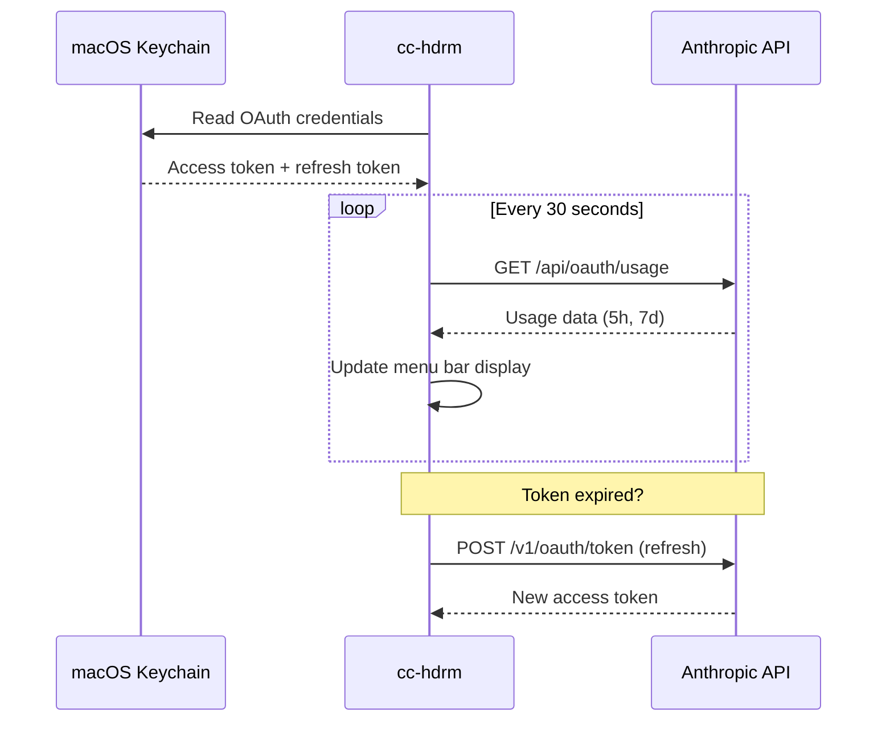

# cc-hdrm

A macOS menu bar utility that shows your Claude usage at a glance. Built for Claude Pro and Max subscribers who use Claude Code and want to avoid mid-task rate limit surprises.

## What It Does

cc-hdrm sits in your menu bar and displays your current 5-hour usage percentage with color-coded warnings. Click it to see detailed usage rings for both 5-hour and 7-day windows, reset countdowns, and your subscription tier.

<p align="center">
  
</p>

### Key Features

- **Zero configuration** — reads OAuth credentials directly from macOS Keychain (from your existing Claude Code login)
- **Zero dependencies** — pure Swift/SwiftUI, no third-party libraries
- **Zero tokens spent** — polls the usage API, not the chat API
- **Background polling** every 30 seconds with automatic token refresh
- **Color-coded thresholds** — green, yellow, orange, red as usage climbs
- **Data freshness tracking** — clear indicator when data is stale or API is unreachable

## Requirements

- macOS 14.0 (Sonoma) or later
- An active [Claude Pro or Max](https://claude.ai/upgrade) subscription
- [Claude Code](https://docs.anthropic.com/en/docs/claude-code) installed and logged in at least once (this creates the Keychain credentials cc-hdrm reads)

## Install

### Homebrew

```sh
brew install rajish/tap/cc-hdrm
```

### Download

Grab the latest `.dmg` from [GitHub Releases](https://github.com/rajish/cc-hdrm/releases/latest).

### Build from Source

You need [Xcode 16+](https://developer.apple.com/xcode/) and [XcodeGen](https://github.com/yonaskolb/XcodeGen).

```sh
# Install XcodeGen if you don't have it
brew install xcodegen

# Clone and build
git clone https://github.com/rajish/cc-hdrm.git
cd cc-hdrm/cc-hdrm
xcodegen generate
open cc-hdrm.xcodeproj
```

Then build and run from Xcode (`Cmd+R`).

To build from the command line:

```sh
cd cc-hdrm/cc-hdrm
xcodegen generate
xcodebuild -project cc-hdrm.xcodeproj -scheme cc-hdrm -configuration Release build
```

## How It Works



cc-hdrm reads the OAuth credentials that Claude Code stores in macOS Keychain. It never stores tokens on disk, never caches them between poll cycles, and never prompts you to log in. If you're logged into Claude Code, cc-hdrm works automatically.

## Status

This project is in active development. Core functionality (menu bar display, usage polling, token refresh, popover with ring gauges) is implemented and working. Notification support for usage thresholds is planned.

## Contributing

See [CONTRIBUTING.md](CONTRIBUTING.md) for guidelines.

## License

[MIT](LICENSE) — Copyright (c) 2026 Radzisław Galler
