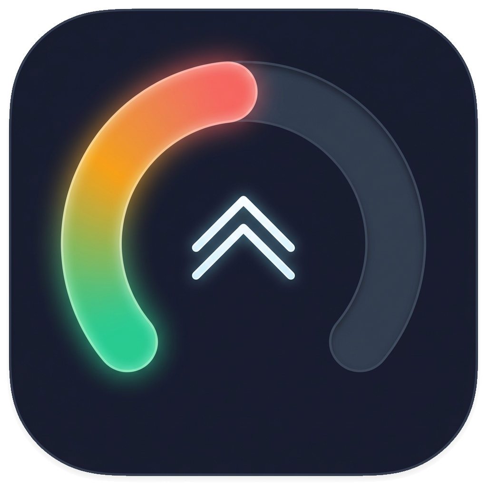
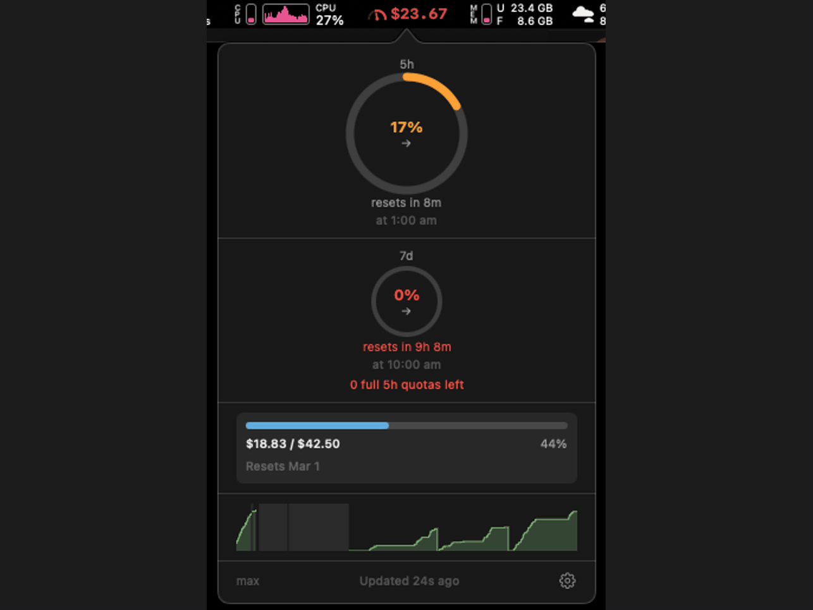
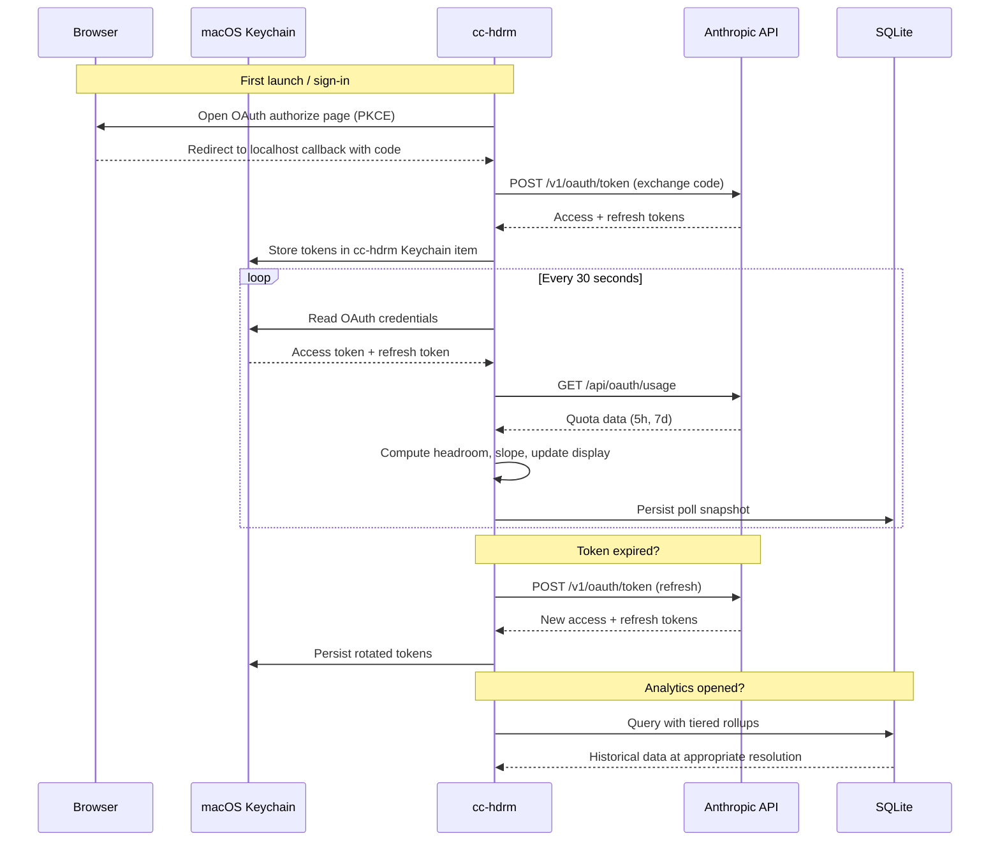

#  cc-hdrm

Like iStat Menus for your Claude subscription. A macOS menu bar app that shows your remaining headroom so you never get surprise-throttled mid-task.

<p align="center">
  
</p>

```sh
brew install rajish/tap/cc-hdrm
```

## Why This Exists

Claude Pro and Max subscribers have no passive way to see how much capacity they have left. The only options — `/usage`, the web dashboard, browser extensions — all interrupt your workflow. cc-hdrm polls the usage API in the background and puts the answer in your menu bar. Zero tokens spent, zero workflow interruption.

## Features

### At a Glance

- **Menu bar headroom** — always-visible percentage with color-coded severity (green → yellow → orange → red) and burn rate arrows (→ ↗ ⬆)
- **One-click sign-in** — OAuth via your browser, no API keys or config files
- **Zero tokens spent** — reads quota data, not the chat API
- **Zero dependencies** — pure Swift/SwiftUI

### Popover Detail

- **Ring gauges** — 5-hour and 7-day headroom with animated fill and slope indicators
- **Reset countdowns** — relative ("resets in 2h 13m") and absolute ("at 4:52 PM")
- **Extra usage tracking** — dollar-based spend vs. limit with color-coded progress bar
- **24-hour sparkline** — step-area chart of recent usage; click to open analytics

### Analytics

- **Historical charts** — 24h, 7d, 30d, and All views with step-area and bar chart visualizations
- **Subscription value breakdown** — used vs. unused dollars prorated from your monthly plan
- **Pattern detection** — identifies overpaying, underpowering, usage decay, and suggests tier changes
- **Self-benchmarking** — cycle-over-cycle comparison across billing periods

### Notifications

- **Threshold alerts** — configurable warnings at customizable headroom levels for both 5h and 7d windows
- **Extra usage alerts** — notifications at 50%, 75%, 90% of extra usage credit
- **Smart re-arming** — thresholds reset when headroom recovers

### Data

- **Local SQLite storage** — every poll snapshot persisted, tiered rollups for efficient querying
- **Configurable retention** — 30 days to 5 years
- **Configurable poll interval** — 10s to 5 min

## Install

### Homebrew

```sh
brew install rajish/tap/cc-hdrm
```

### Download

Grab the latest `.dmg` from [GitHub Releases](https://github.com/rajish/cc-hdrm/releases/latest).

### Build from Source

See [CONTRIBUTING.md](CONTRIBUTING.md) for development setup.

## Getting Started

1. **Launch** — cc-hdrm appears in your menu bar
2. **Sign In** — click the menu bar icon, then "Sign In"
3. **Approve** — log in to Anthropic in your browser and authorize
4. **Done** — headroom appears immediately

## Security & Privacy

- **OAuth with PKCE** — authenticates directly with Anthropic via your browser; no passwords or API keys touch cc-hdrm
- **Keychain storage** — tokens stored in a dedicated macOS Keychain item, never written to disk
- **Read-only** — only reads quota data, cannot send messages or modify your account
- **No telemetry** — no analytics, no tracking, no data leaves your machine
- **Fully open source** — audit every line: the entire codebase is right here

## How It Works


```mermaid
sequenceDiagram
    participant B as Browser
    participant K as macOS Keychain
    participant A as cc-hdrm
    participant API as Anthropic API
    participant DB as SQLite

    Note over B,A: First launch / sign-in
    A->>B: Open OAuth authorize page (PKCE)
    B-->>A: Redirect to localhost callback with code
    A->>API: POST /v1/oauth/token (exchange code)
    API-->>A: Access + refresh tokens
    A->>K: Store tokens in cc-hdrm Keychain item

    loop Every 30 seconds
        A->>K: Read OAuth credentials
        K-->>A: Access token + refresh token
        A->>API: GET /api/oauth/usage
        API-->>A: Quota data (5h, 7d)
        A->>A: Compute headroom, slope, update display
        A->>DB: Persist poll snapshot
    end
    Note over A,API: Token expired?
    A->>API: POST /v1/oauth/token (refresh)
    API-->>A: New access + refresh tokens
    A->>K: Persist rotated tokens
    Note over A,DB: Analytics opened?
    A->>DB: Query with tiered rollups
    DB-->>A: Historical data at appropriate resolution
```

## Requirements

- macOS 14.0 (Sonoma) or later
- An active [Claude Pro or Max](https://claude.ai/upgrade) subscription
- macOS only for now — contributions for other platforms welcome

## Contributing

See [CONTRIBUTING.md](CONTRIBUTING.md) for guidelines.

## License

[MIT](LICENSE) — Copyright (c) 2026 Radzisław Galler
