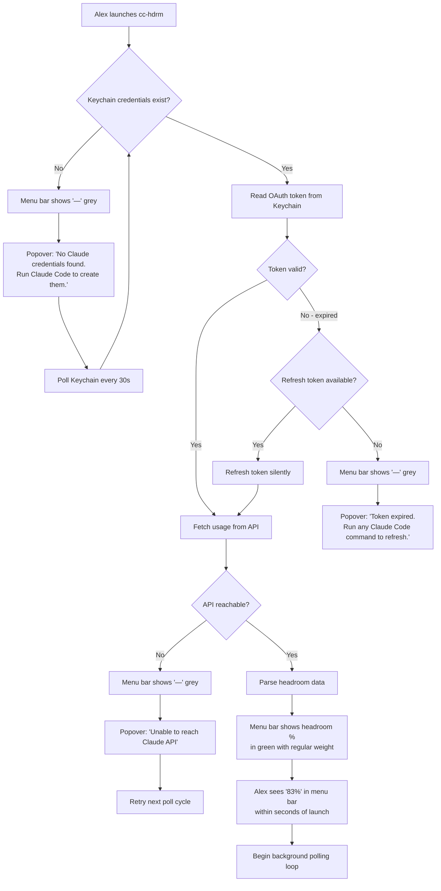
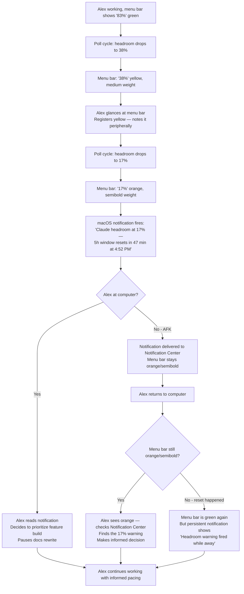
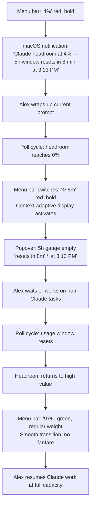
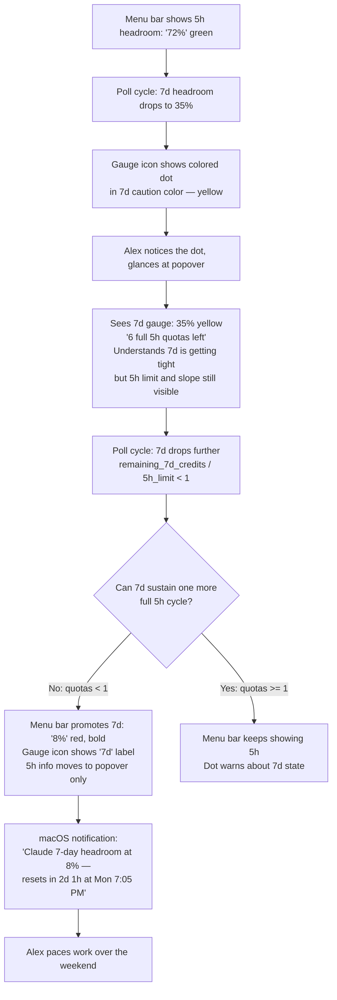
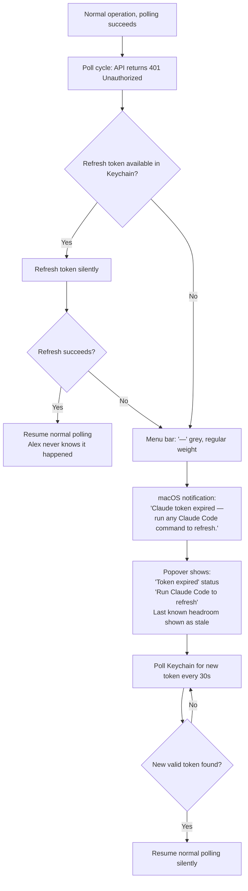

# UX Design Specification cc-hdrm

**Author:** Boss
**Date:** 2026-01-31

---

## Executive Summary

### Project Vision

cc-hdrm is a "fuel gauge for your Claude subscription" — a macOS menu bar utility that provides always-visible, zero-effort usage awareness for power developers running Claude Code sessions. The UX philosophy is radical simplicity: the app should feel like native macOS infrastructure (like the battery or Wi-Fi icon), not like a separate tool to learn or manage. The ideal state is that Alex forgets it's a third-party app entirely.

### Target Users

**Primary Persona: Alex — The Always-On Power Dev**
- Solo developer, Claude Max subscriber, multiple concurrent Claude Code sessions
- Lives in the terminal on macOS, menu bar is natural peripheral vision territory
- Expects zero-config, zero-friction tools — if it requires setup, it's already failed
- Tech-savvy but has no patience for unnecessary complexity
- Needs *passive awareness*, not active monitoring — the information should come to him

**Key behavioral insights:**
- Glances at menu bar for quick status; rarely clicks to expand
- When capacity is available: cares about *percentage remaining*
- When capacity is exhausted: cares about *time until reset*
- May be away from computer when critical thresholds are crossed — notifications must not be silently lost
- Notifications are valuable but can overlap active UI elements — every alert must justify its interruption

### Key Design Challenges

1. **Context-adaptive display** — The menu bar indicator must show the *right* information at the *right* time. Percentage when there's capacity, countdown when exhausted. This is a state machine, not a static display.
2. **Dual-window awareness** — Both 5-hour and 7-day limits can independently cause cutoffs. The menu bar has very little space, but both limits need warning coverage — not just the 5-hour window.
3. **Notification persistence** — macOS notifications disappear after a timeout. If Alex is AFK when an 80% warning fires, he comes back with no trace of it. The app needs a secondary signal (menu bar state change, badge, or repeated notification) so warnings are never silently lost.
4. **Notification intrusiveness balance** — Alerts overlap browser tabs, buttons, and active UI. Every notification must earn its interruption — too many and Alex disables them, too few and he gets blindsided.

### Design Opportunities

1. **State-driven menu bar icon** — Rather than a static percentage, an icon that morphs based on state (normal → warning → critical → exhausted → recovering) could convey meaning in peripheral vision without requiring reading a number at all.
2. **"Missed warning" recovery** — If a notification was delivered while Alex was away, the menu bar could show a subtle badge or pulsing state to indicate "something changed while you were gone." This solves the AFK notification gap elegantly.
3. **7-day limit surfacing** — Since the menu bar primarily shows 5-hour data, the 7-day limit could surface *only when it's the more urgent constraint* — automatically promoting itself when the weekly window is tighter than the session window.

## Core User Experience

### Defining Experience

The core experience of cc-hdrm is **the glance** — a sub-1-second peripheral scan of the menu bar that answers "am I okay?" without any conscious effort. The app's primary job is to keep Alex informed through passive visual signals, not active interaction. The most frequent "interaction" is not a click — it's a flick of the eyes to the top-right corner of the screen.

The secondary experience is **the notification** — a self-contained, actionable alert that delivers all the information Alex needs (percentage, threshold, reset countdown) without requiring him to click, expand, or navigate anywhere. If he's AFK, the notification trail and menu bar state changes ensure nothing is silently lost.

The tertiary experience is **the expand** — a rare but important deep-dive into the full picture. When Alex clicks, the panel presents information in strict priority order: 5-hour bar and countdown first, 7-day bar and countdown second.

### Platform Strategy

- **Platform:** macOS menu bar only (NSStatusItem + SwiftUI popover)
- **Input:** Mouse/trackpad only — click to expand, that's it. No keyboard shortcuts needed for MVP.
- **Offline/disconnected:** Graceful degradation — show disconnected state, no stale data, auto-resume on reconnect
- **System integration:** macOS Keychain (auth), UserNotifications (alerts), NSStatusItem (menu bar presence)
- **Constraints:** No main window, no dock icon, minimal permissions. The app is invisible infrastructure.

### Effortless Interactions

1. **Zero-config onboarding** — Launch the app, it finds Keychain credentials, usage appears in the menu bar. No login, no setup wizard, no config file. If it takes more than 5 seconds from launch to data, something is wrong.
2. **Context-adaptive display** — Menu bar automatically shows percentage when capacity exists, countdown when exhausted. Alex never switches modes or toggles anything.
3. **Self-contained notifications** — Every notification carries the full context: "Claude usage at 83% — 5h window resets in 47 min." Alex can act on the notification alone without expanding the panel.
4. **Auto-resume** — After disconnection, token refresh, or window reset, the app silently returns to normal. No "reconnecting..." dialogs, no manual retry buttons.

### Critical Success Moments

1. **First launch → data in seconds.** This is the "where has this been all my life" moment. If Alex sees his usage percentage appear without any setup, we've won. If he sees a login screen, we've lost.
2. **First prevented cutoff.** The first time Alex gets a notification, paces his work, and avoids a mid-task cutoff — that's the moment cc-hdrm becomes permanent infrastructure.
3. **The AFK return.** Alex comes back from being away. The menu bar shows green at 12% — the window reset while he was gone. If he had an unacknowledged warning before leaving, the menu bar or a persistent notification makes sure he knows what happened. No silent state changes.
4. **The 95% grace period.** Alex sees red, the notification says "resets in 8 min," he wraps up cleanly. This is the entire product thesis in one moment.

### Experience Principles

1. **Peripheral first** — The menu bar glance is the primary interface. Every design decision optimizes for sub-1-second comprehension via color + number. The popover is secondary; notifications are the bridge.
2. **Self-contained signals** — Every notification, every menu bar state, every visual cue must carry enough information to act on *without* requiring a follow-up interaction.
3. **Escalation, not binary** — Urgency is a spectrum, not an on/off switch. The app's response should escalate proportionally: color shift → notification → persistent notification. Design for configurability even if MVP ships with fixed thresholds.
4. **Invisible infrastructure** — The best UX is when Alex forgets cc-hdrm is a third-party app. No chrome, no branding, no unnecessary UI. It should feel like Apple built it into the OS.
5. **Never lose a warning** — If a threshold was crossed, Alex must know — even if he was AFK, even if the notification dismissed itself. The menu bar state is the permanent record.

## Desired Emotional Response

### Primary Emotional Goals

**Primary: Emotional neutrality through passive awareness.** The ideal emotional state is *the absence of feeling*. When cc-hdrm is working and usage is normal, Alex should feel nothing about it — the same way he feels nothing about a working Wi-Fi icon. The app succeeds when it's emotionally invisible.

**Secondary: Calm agency during escalation.** When usage rises into warning territory, the emotional shift should be from "nothing" to "informed decision-making." Not panic, not stress — just a quiet awareness that it's time to prioritize. The feeling of a trusted advisor, not an alarm system.

**Tertiary: Justified annoyance on failure.** When the app can't reach the API or credentials are expired, Alex should feel annoyed at the tool — not anxious about his usage. The failure state must be unambiguously "the tool is broken," never "am I out of capacity?"

### Emotional Journey Mapping

| State            | Alex Feels            | Design Implication                                                                                                        |
| ---------------- | --------------------- | ------------------------------------------------------------------------------------------------------------------------- |
| Green (< 60%)    | Nothing. Invisible.   | Minimal visual presence — muted color, small number, no attention-grabbing elements                                       |
| Yellow (60-80%)  | Subtle awareness      | Color shift is enough — no notification, no urgency. A peripheral nudge.                                                  |
| Orange (80-95%)  | Calm decision-making  | Notification fires with full context. Tone is informational, not urgent. "Here's where you stand, here's when it resets." |
| Red (> 95%)      | Heightened attention  | Persistent notification. The feeling is "I need to wrap up" not "I'm in trouble."                                         |
| Exhausted (100%) | Patient waiting       | Countdown to reset. The feeling is "I know exactly when I'm back." No helplessness.                                       |
| Disconnected     | Annoyance at the tool | Clearly distinct from usage states. "The app can't reach the API" not "your usage is unknown."                            |
| Post-reset       | Nothing again         | Smooth return to green. No fanfare, no "you're back!" celebration. Just quiet normalcy.                                   |

### Micro-Emotions

**Confidence over Confusion (Critical)**
- Alex must *always* understand what the number and color mean at a glance
- No ambiguous states — every visual has one clear interpretation
- The disconnected state must be visually distinct from any usage state to prevent misreading

**Trust over Skepticism (Critical)**
- Alex must believe the data is current and accurate
- If data is stale, say so explicitly — never display stale numbers as if they're fresh
- The "last updated" signal should be available (in the popover) without cluttering the menu bar

**Calm over Anxiety (Foundational)**
- This is the entire product thesis — replacing anxiety with awareness
- Every design choice should be tested against: "does this add calm or add stress?"
- Notifications inform, they don't alarm. Language is factual, not emotional.

### Design Implications

- **Confidence** → Clear, unambiguous color coding with no overlapping meanings. Disconnected state uses a completely different visual language (grey, dash) from usage states (green/yellow/orange/red).
- **Trust** → Never show stale data without indicating staleness. Popover includes a subtle "updated Xs ago" timestamp. If data is more than 60s old, the menu bar reflects this.
- **Calm** → Notification copy is factual and actionable: "Claude usage at 83% — 5h window resets in 47 min." No exclamation marks, no "Warning!", no red emoji. Just information.
- **Neutrality at green** → Menu bar presence at low usage should be as visually quiet as possible. Muted green or even monochrome. The number is small. It should not compete for attention with anything else in the menu bar.
- **Annoyance on failure** → Disconnected state is clearly a *tool problem*, not a *usage problem*. Show "—" or a grey icon, not "?" which could imply unknown usage.

### Emotional Design Principles

1. **Invisibility is the highest praise** — At normal usage, the app should evoke zero emotion. If Alex notices it when things are fine, we're too loud.
2. **Inform, don't alarm** — Every escalation step should add *information*, not *stress*. The transition from green to orange should feel like gaining knowledge, not losing control.
3. **Ambiguity is the enemy of trust** — Every visual state must have exactly one meaning. If Alex ever asks "wait, does that mean...?" we've failed.
4. **Failure is annoying, not scary** — Disconnected/error states must be visually and emotionally distinct from usage states, channeling frustration at the tool rather than anxiety about capacity.
5. **Factual language only** — Notification copy uses numbers, times, and facts. Never urgency words, never emotional language, never exclamation marks.

## UX Pattern Analysis & Inspiration

### Inspiring Products Analysis

**iStat Menus**
- Proves complex system data can live in the menu bar through compact visualization
- Color carries meaning (CPU load → green/yellow/red) — not decoration
- Popover provides deep-dive detail but the menu bar item is self-sufficient for quick reads
- Information density is high but never feels cluttered — achieved through consistent visual grammar
- Key lesson: *A tiny space can carry rich data if every visual element has a job*

**Bartender**
- Entire product exists because menu bar clutter is a real pain point
- Teaches that every menu bar item must justify its pixel footprint
- Users have strong preferences about what stays visible vs. gets hidden
- Key lesson: *Be compact and valuable enough that users never want to hide you*

**macOS Clock**
- The benchmark for peripheral readability — glanced at dozens of times daily, never consciously "used"
- Font size, contrast, and positioning are all optimized for the sub-1-second glance
- Completely invisible as a "feature" — it's just *there*
- Click-to-expand reveals calendar detail, but the menu bar text is self-sufficient
- Key lesson: *The ideal menu bar item is one you read without focusing your eyes*

### Transferable UX Patterns

**Information Density Pattern (from iStat Menus)**
- Compact numeric display with color-as-meaning in the menu bar
- Applies directly to cc-hdrm: percentage + color coding in minimal space
- Popover expands to detailed bars and countdowns only when explicitly requested

**Peripheral Readability Pattern (from Clock)**
- Optimized for the glance — readable in peripheral vision without conscious focus
- Applies to cc-hdrm: the percentage number and color must register in under 1 second
- Font weight, size, and color contrast must be tuned for peripheral scanning, not direct reading

**Silent Until Relevant Pattern (from all three)**
- No attention-seeking behavior during normal operation
- Escalation only when state warrants it
- Applies to cc-hdrm: green state is maximally quiet, escalation is proportional

**Compact Footprint Pattern (from Bartender lesson)**
- Menu bar presence should be as small as functionally possible
- cc-hdrm should aim for width comparable to the clock or a single iStat module
- If Alex would consider hiding us in Bartender, our footprint is too large

### Anti-Patterns to Avoid

1. **Badge/dot overload** — Some menu bar apps pile on red dots, badges, and counts. This creates notification fatigue and trains users to ignore signals. cc-hdrm should use color *shift* not color *addition*.
2. **Ambiguous icons** — Menu bar items that use abstract icons without text force the user to remember what the icon means. cc-hdrm should always show a readable number — the icon alone isn't enough.
3. **Chatty notifications** — Apps that fire notifications for routine status updates teach users to disable notifications entirely. cc-hdrm notifications must only fire at genuine threshold crossings, never for "still at 45%."
4. **Stale-without-indicating** — Some monitoring apps show old data without any staleness signal. This erodes trust. cc-hdrm must never display a number it can't vouch for as current.

### Design Inspiration Strategy

**Adopt:**
- iStat Menus' color-as-meaning pattern for the menu bar indicator
- Clock's peripheral readability as the benchmark for font/contrast/size decisions
- All three apps' "silent until touched" interaction model

**Adapt:**
- iStat Menus' popover detail level — simplify for cc-hdrm's narrower data set (just 2 bars + 2 countdowns + tier)
- Clock's static display — adapt to cc-hdrm's context-switching behavior (percentage ↔ countdown based on state)

**Avoid:**
- Badge/dot notification patterns that create visual noise
- Abstract icon-only displays that require learned interpretation
- Notification frequency that trains users to ignore alerts
- Displaying data without freshness guarantees

## Design System Foundation

### Design System Choice

**Native macOS (Apple HIG) + Minimal Custom SwiftUI Views**

cc-hdrm will use Apple's native design language as its foundation, with lightweight custom SwiftUI views only where the specific data display requirements (usage bars, color-coded percentages, countdowns) demand it.

### Rationale for Selection

1. **"Apple built it" principle** — Our emotional design goal is invisible infrastructure. Native macOS styling is the fastest path to feeling like a system utility, not a third-party app.
2. **Tiny UI surface area** — The entire interface is one menu bar item and one popover panel. A design system framework would be massive overhead for ~5 custom views.
3. **Automatic platform integration** — SwiftUI natively handles light/dark mode, Dynamic Type accessibility, accent color preferences, and macOS version-appropriate styling. Zero effort for full platform compliance.
4. **Solo developer, zero dependencies** — No third-party UI libraries to maintain, update, or debug. The only dependency is Apple's SDK.
5. **Inspiration alignment** — iStat Menus, Bartender, and the macOS Clock all use native styling. Following this pattern keeps cc-hdrm in the same visual family.

### Implementation Approach

**Native (use as-is):**
- `NSStatusItem` for menu bar presence
- SwiftUI `Popover` for the expanded panel
- `UserNotifications` framework for threshold alerts
- SF Symbols for any iconography
- System font (SF Pro) at system-standard sizes
- Native macOS color palette for backgrounds, borders, text

**Custom SwiftUI views (build):**
- Usage bar component — horizontal progress bar with color fill (green/yellow/orange/red)
- Countdown label component — "resets in Xh Ym" with live updating
- Menu bar text renderer — colored percentage or countdown text in the status item
- State-adaptive display logic — switching between percentage and countdown based on capacity state

### Customization Strategy

- **Color tokens:** Define a small set of semantic colors (`.usageNormal`, `.usageWarning`, `.usageCritical`, `.usageExhausted`, `.disconnected`) that map to the green/yellow/orange/red/grey palette. These are the only custom colors in the app.
- **Typography:** System font throughout. No custom fonts. Size and weight follow Apple HIG for menu bar items and popover content.
- **Spacing/layout:** Follow Apple HIG spacing guidelines for popover content. The popover should feel like a native macOS panel, not a custom UI.
- **Dark mode:** Automatic via SwiftUI. Color tokens must work in both light and dark appearances — test early.
- **Accessibility:** VoiceOver labels on all custom views. Usage bars must announce percentage and countdown values. Color is never the *only* signal — the number is always present alongside the color.

## Defining Core Experience

### Defining Experience

**"Glance at the menu bar, know exactly how much headroom you have."**

cc-hdrm's defining experience is passive awareness of remaining capacity. The word "headroom" — embedded in the product name itself — frames every number, every color, every interaction. Alex never asks "how much have I used?" He asks "how much can I still do?" The app answers that question continuously, silently, without costing a single token — and critically, *even while a prompt is actively running*, when `/usage` and every other channel is completely inaccessible.

### User Mental Model

**The fuel gauge, not the odometer.**

Alex's mental model is depletion-based: he has a tank of capacity, and it drains as he works. The number in the menu bar represents what's *left*, not what's been consumed. This is the headroom model.

- **83%** means "I have 83% of my capacity remaining" — plenty of room
- **17%** means "only 17% left" — time to prioritize
- **0%** means "empty, waiting for reset" — show countdown

**Key mental model insight:** Alex cannot check usage through any other channel while a Claude prompt is running. He must either wait for the response to finish or spawn a new CLI session just to run `/usage`. cc-hdrm is the *only* way to see capacity during active use — the exact moments when consumption is highest and visibility matters most.

**Current workarounds and their failures:**
- `/usage` — costs tokens, breaks flow, *completely unavailable during active prompts*
- claude.ai dashboard — full context switch to browser, manual navigation
- claude-counter extension — browser-only, useless for CLI/TUI users
- Guessing — the current default, source of all the anxiety

### Success Criteria

1. **Sub-1-second comprehension** — Alex glances at the menu bar and knows his headroom without conscious effort. Color + number register in peripheral vision.
2. **Always available** — Data is visible even when a prompt is running, when the terminal is full-screen, when multiple sessions are active. The menu bar is always accessible.
3. **Self-evident state transitions** — When headroom hits 0% and the display switches from percentage to countdown, Alex immediately understands "I'm out, this is when I'm back." No explanation needed.
4. **No false confidence** — If the data is stale or the API is unreachable, the display makes this unambiguously clear. Alex never sees a number and trusts it when he shouldn't.
5. **First prevented cutoff** — The first time Alex paces work based on a headroom warning and avoids a mid-task cutoff, the product has proven its value permanently.

### Novel UX Patterns

**Established patterns (no education needed):**
- Color-coded status in menu bar (iStat Menus precedent)
- Click-to-expand popover (standard macOS pattern)
- macOS notifications for threshold alerts (system-standard)

**Novel but self-evident:**
- **Context-adaptive display** — percentage ↔ countdown switch based on headroom state. This is novel (most menu bar apps show a static data type) but self-evident because "83%" and "↻ 12m" are visually and semantically distinct. No education required.
- **Headroom framing** — Most usage displays show consumption ("42% used"). cc-hdrm inverts this to show remaining capacity ("42% headroom"). This aligns with the fuel gauge mental model and requires no teaching — it's how Alex already thinks.

**No novel patterns requiring education.** Every interaction uses either a standard macOS pattern or a self-evident adaptation of one.

### Experience Mechanics

**1. Initiation — The Glance**
- Trigger: Alex's eyes drift to the menu bar (involuntary, peripheral)
- What he sees: Claude sparkle icon + colored number showing headroom percentage (e.g., green "✳ 83%")
- Duration: < 1 second
- Outcome: Alex knows he's fine (or not) and returns focus to his work

**2. Interaction — The Expand (rare)**
- Trigger: Alex clicks the menu bar item (conscious, intentional)
- What he sees: popover with 5h headroom bar + countdown, 7d headroom bar + countdown, subscription tier
- Information hierarchy: 5h bar → 5h countdown → 7d bar → 7d countdown → tier
- Duration: 2-5 seconds
- Outcome: Alex has full context and closes the popover

**3. Feedback — The Notification**
- Trigger: headroom crosses a threshold (20%, 5%)
- What Alex sees: macOS notification with full context — "Claude headroom at 17% — 5h window resets in 47 min"
- Escalation: configurable from color-shift-only up to persistent notification (MVP: fixed thresholds)
- Outcome: Alex makes an informed decision about priorities

**4. State Transition — The Exhaustion**
- Trigger: headroom reaches 0%
- What changes: menu bar switches from percentage to countdown ("↻ 12m")
- Color: red (or distinct exhausted state)
- Outcome: Alex knows exactly when capacity returns, waits or works on non-Claude tasks

**5. Recovery — The Reset**
- Trigger: usage window resets, headroom returns to high value
- What changes: countdown disappears, percentage returns, color shifts to green
- No fanfare: just quiet return to normalcy
- Outcome: Alex sees green, resumes work

## Visual Design Foundation

### Color System

**Semantic Headroom Colors (the only custom colors in the app):**

| Token              | Meaning         | Light Mode  | Dark Mode   | Usage                        |
| ------------------ | --------------- | ----------- | ----------- | ---------------------------- |
| `.headroomNormal`    | > 40% headroom  | Muted green | Muted green | Menu bar text, gauge fill    |
| `.headroomCaution`   | 20-40% headroom | Yellow      | Yellow      | Menu bar text, gauge fill    |
| `.headroomWarning`   | 5-20% headroom  | Orange      | Orange      | Menu bar text, gauge fill    |
| `.headroomCritical`  | < 5% headroom   | Red         | Red         | Menu bar text, gauge fill    |
| `.headroomExhausted` | 0% headroom     | Red         | Red         | Countdown text, empty gauge  |
| `.disconnected`      | API unreachable | System grey | System grey | Menu bar "—", gauge inactive |

**Non-headroom colors:** All from native macOS system palette. Popover background, text, borders, dividers — all system defaults. No custom colors outside the headroom semantic set.

**Color behavior:**
- Menu bar text color = headroom color token (shifts with state)
- Gauge fill color = same headroom color token
- Gauge track (unfilled portion) = system tertiary color (subtle, low contrast)
- All colors must pass WCAG AA contrast against both light and dark menu bar backgrounds

### Typography System

**Font:** SF Pro (system font) — no exceptions, no custom fonts.

**Menu bar item:**
- Font size: System standard for `NSStatusItem` text
- Weight escalation by headroom state:
  - `.headroomNormal` (> 40%): Regular weight — blends into menu bar, minimal attention
  - `.headroomCaution` (20-40%): Medium weight — slightly more present
  - `.headroomWarning` (5-20%): Semibold — draws peripheral attention
  - `.headroomCritical` (< 5%): Bold — demands notice
  - `.headroomExhausted` (0%): Bold — countdown is prominent
  - `.disconnected`: Regular weight — grey "—" is quiet, signals tool problem not usage problem

**Popover content:**
- Section labels: System caption size, secondary color
- Headroom percentage inside gauges: System body size, bold, headroom color
- Countdown text: System caption size, secondary color
- Subscription tier: System caption size, tertiary color
- "Updated Xs ago": System mini size, tertiary color

### Spacing & Layout Foundation

**Popover layout: Dense, iStat Menus-inspired**

- Minimal padding — content-to-edge spacing follows Apple HIG minimum
- No decorative whitespace — every pixel serves information
- Compact vertical stacking — sections separated by hairline dividers, not space

**Popover structure (top to bottom):**
1. Two circular gauges side by side: 5h headroom (left), 7d headroom (right)
2. Each gauge shows: percentage in center, "resets in Xh Ym" below
3. Subscription tier label (small, bottom)
4. "Updated Xs ago" timestamp (smallest, bottom)
5. Quit option

**Circular gauge specifications:**
- Ring style (not filled circle) — depletes clockwise as headroom decreases
- Ring fill color = headroom color token for that window
- Ring track = system tertiary (subtle unfilled portion)
- Percentage number centered inside the ring, bold, headroom-colored
- Countdown label below each gauge, secondary text color
- Label above or inside: "5h" / "7d" to identify which window

**Menu bar footprint:**
- Target width: comparable to clock or single iStat module
- Format: GaugeIcon (semicircular gauge) + percentage or countdown (e.g., "67%" or "↻ 12m")
- GaugeIcon serves as the primary visual anchor with color reflecting headroom state
- GaugeIcon corner indicator for 7d awareness:
  - **Colored dot** when 7d is in caution/warning/critical but NOT promoted — dot uses 7d HeadroomState color
  - **"7d" label** when 7d IS promoted (remaining 7d budget can't sustain one more 5h cycle) — makes source switch unambiguous
  - **Empty** when 7d is normal (>40% headroom) or disconnected — quiet when everything is fine
- Disconnected state: "—" in grey

### Accessibility Considerations

- **Color is never the only signal** — headroom is always communicated via number + color + font weight. A colorblind user sees the number and feels the weight change.
- **VoiceOver labels** on all custom views: gauges announce "5-hour headroom: 83%, resets in 2 hours 13 minutes"
- **Contrast ratios** — all headroom colors tested against both light and dark mode menu bar and popover backgrounds, WCAG AA minimum
- **Dynamic Type** — popover text respects system text size preferences via SwiftUI defaults
- **Reduced Motion** — if gauge animations are added (fill/deplete transitions), respect `accessibilityReduceMotion` preference

## Design Direction Decision

### Design Directions Explored

Six directions were explored via HTML mockup (`ux-design-directions.html`):

1. **Classic Dual Gauge** — Two large ring gauges side by side, symmetrical
2. **Compact Inline** — Small gauges with info beside them, ultra-dense horizontal
3. **Warning State** — Classic dual gauge showing orange escalation
4. **Exhausted State** — Empty gauges with countdown display
5. **Disconnected State** — Inactive gauges with error messaging
6. **Stacked Vertical** — Gauges stacked vertically, 5h larger (primary), 7d smaller (secondary)

Additionally, menu bar state comparisons across all headroom levels and notification mockups were evaluated.

### Chosen Direction

**Direction 6: Stacked Vertical** with information enhancement.

- 5h gauge is larger and positioned first (primary)
- 7d gauge is smaller and positioned below (secondary)
- Narrower popover footprint, taller layout
- Information hierarchy reinforced through gauge size differentiation

**Enhancement: Dual time display (relative + absolute)**

Each gauge shows three pieces of time information:
- Headroom percentage inside the ring
- Relative countdown below: "resets in 47m"
- Absolute time below that: "at 4:52 PM"

This gives Alex both the quick-glance relative time for in-the-moment decisions and the absolute time for planning ("I'll come back after lunch").

### Design Rationale

1. **Vertical stack reinforces hierarchy** — The 5h window is the most frequently relevant constraint. Making it larger and placing it first means Alex's eye lands on the most important data immediately.
2. **Narrower popover** — A vertically stacked layout results in a narrower popover that feels more like a native macOS dropdown than a dashboard panel. Less horizontal disruption.
3. **7d as secondary** — The weekly limit matters but is checked less often. Smaller gauge size communicates "this is here if you need it" without competing for attention with the 5h data.
4. **Absolute + relative time** — Relative time ("47m") supports split-second decisions. Absolute time ("4:52 PM") supports planning. Together they eliminate all mental math.

### Implementation Approach

**Popover structure (top to bottom):**

1. **5h headroom gauge** (large ring, ~96px)
   - Percentage centered in ring, bold, headroom-colored
   - "5h" label above
   - "resets in 47m" below (secondary text)
   - "at 4:52 PM" below that (tertiary text)
2. **Hairline divider**
3. **7d headroom gauge** (small ring, ~56px)
   - Percentage centered in ring, bold, headroom-colored
   - "7d" label above
   - "resets in 2d 1h" below (secondary text)
   - "at Mon 7:05 PM" below that (tertiary text)
4. **Hairline divider**
5. **Footer row:** subscription tier (left), "updated Xs ago" (center), Quit (right)

**Menu bar display:**
- Shows Claude sparkle icon + 5h headroom percentage by default (e.g., "✳ 83%")
- Switches to countdown when exhausted ("✳ ↻ 12m")
- When 7d is the tighter constraint and in warning/critical, menu bar reflects 7d instead
- Color + weight escalate per headroom state

**Notification content:**
- "Claude headroom at 17% — 5h window resets in 47 min (at 4:52 PM)"
- Includes absolute time in notifications too, for AFK scenarios

## User Journey Flows

### Journey 1: First Launch — "Where has this been all my life?"

**Trigger:** Alex downloads and launches cc-hdrm for the first time.



**Success moment:** Alex sees a green percentage appear in his menu bar within 5 seconds of launch. No login screen, no config, no wizard. He clicks it — stacked vertical popover drops down with 5h gauge, 7d gauge, countdowns with absolute times. He exhales.

**Key UX decisions:**
- No credentials → grey "—" with clear instructions, not an error dialog
- Token expired → low-urgency message, not a blocking modal
- API unreachable → grey "—", auto-retry, no user action needed
- Success → data appears silently, no "welcome" splash, no onboarding tour

### Journey 2: Daily Flow — "Informed pacing"

**Trigger:** Alex is working across multiple Claude Code sessions. Headroom is dropping.



**Key UX decisions:**
- Yellow (caution) = color shift only, no notification — peripheral nudge
- Orange (warning) = notification fires with full context including absolute reset time
- AFK scenario = notification persists in Notification Center + menu bar state serves as permanent record
- Post-reset AFK return = persistent notification ensures the warning isn't silently lost even though the crisis has passed

### Journey 3: The Wall — "Wrap up and wait"

**Trigger:** Alex is deep in a refactor. Headroom is critically low and approaching exhaustion.



**Key UX decisions:**
- 4% = bold red + persistent notification with absolute reset time
- 0% = menu bar switches from percentage to countdown ("↻ 8m") — self-evident transition
- Countdown includes absolute time in popover ("at 3:13 PM") so Alex can plan
- Reset = quiet return to green. No "you're back!" celebration. Just normalcy.

### Journey 4: The Tighter Window — "7-day takes priority"

**Trigger:** 5h window has plenty of headroom, but 7d weekly limit is running low.



**Key UX decisions:**
- 7d awareness via colored dot on gauge icon — appears at caution/warning/critical without hiding 5h info
- 7d promotes to menu bar only when remaining 7d budget can't sustain one more full 5h cycle (credit-math rule: `remaining_7d_credits / 5h_credit_limit < 1`)
- When promoted, a "7d" label on the gauge icon makes the source switch unambiguous
- Popover always shows both windows, plus "X full 5h quotas left" in the 7d section for transparency
- 5h limit, slope indicator, and all 5h data remain visible until 7d is genuinely the binding constraint
- 7d notifications use "7-day" in the text to distinguish from 5h alerts

### Journey 5: Token Expiry — "The tool hiccup"

**Trigger:** OAuth token expires while cc-hdrm is running.



**Key UX decisions:**
- If refresh token exists → fully silent, invisible infrastructure
- If no refresh token → grey "—", low-urgency notification, clear instructions
- Annoyance, not anxiety — the display is unambiguously "tool problem" (grey) not "usage problem" (red)
- Auto-recovers when Alex runs any Claude Code command (which triggers a token refresh in Keychain)
- Polls Keychain for new token — Alex doesn't need to restart cc-hdrm

### Journey Patterns

**State Communication Pattern:**
Every state change follows the same pattern: menu bar updates (color + weight + number) → notification fires if threshold crossed → popover reflects detailed state. These three channels always agree.

**Graceful Degradation Pattern:**
Failure states (disconnected, token expired, no credentials) all follow the same visual language: grey "—" in menu bar, descriptive message in popover, low-urgency notification. Never ambiguous with usage states.

**Auto-Recovery Pattern:**
Every failure state includes automatic recovery polling. Alex never needs to manually retry, restart, or reconfigure. The app heals itself when the underlying condition resolves.

**Tighter Constraint Pattern:**
When 7d remaining budget can't sustain one more full 5h cycle (`remaining_7d_credits / 5h_credit_limit < 1`), the menu bar promotes 7d as the binding constraint. Otherwise, 5h stays primary with a colored dot on the gauge icon providing ambient 7d awareness at caution/warning/critical. The popover always shows both windows plus "X full 5h quotas left" in the 7d section. This ensures 5h info (the primary working context) is visible unless 7d is genuinely binding.

### Flow Optimization Principles

1. **Zero-step recovery** — Every failure state auto-recovers. Alex never clicks "retry" or restarts the app.
2. **Single source of truth** — Menu bar, popover, and notifications always show consistent data from the same poll cycle.
3. **Promote by binding constraint** — The menu bar shows 7d only when it's genuinely the binding constraint (can't fit one more 5h cycle). Otherwise 5h stays primary with a dot for 7d awareness. The popover shows everything.
4. **Factual notifications** — Every notification contains: what (headroom %), which window (5h/7d), when relative (resets in Xm), when absolute (at X:XX PM).
5. **AFK resilience** — Warnings are never silently lost. Persistent notifications + menu bar state change ensure Alex knows what happened while away.

## Component Strategy

### Design System Components

**Native SwiftUI (use as-is, no customization):**

| Component         | Usage                                    | Notes                             |
| ----------------- | ---------------------------------------- | --------------------------------- |
| `NSStatusItem`      | Menu bar presence                        | Hosts the MenuBarTextRenderer     |
| SwiftUI `Popover`   | Expanded panel container                 | Standard macOS popover with arrow |
| `UserNotifications` | Threshold alerts                         | System notification framework     |
| `Divider`           | Hairline separators in popover           | Standard SwiftUI divider          |
| `Text` / `Label`    | Section labels, tier display, timestamps | System font, standard sizing      |
| `Menu`              | Gear menu (Quit, future settings)        | Standard SwiftUI menu component   |
| SF Symbols        | Gear icon, refresh icon (↻)              | System icon set                   |

### Custom Components

#### HeadroomRingGauge

**Purpose:** Visualize remaining headroom as a circular ring that depletes clockwise.

**Usage:** Two instances in the popover — large (5h, primary) and small (7d, secondary).

**Anatomy:**
- Ring track (full circle, system tertiary color)
- Ring fill (partial arc, headroom color token, depletes clockwise from 12 o'clock)
- Center text (percentage, bold, headroom-colored)
- Top label ("5h" or "7d", caption size, secondary color)

**Props/Inputs:**
- `headroomPercentage: Double` (0.0–100.0)
- `windowLabel: String` ("5h" or "7d")
- `ringSize: CGFloat` (96px for primary, 56px for secondary)
- `strokeWidth: CGFloat` (7px for primary, 4px for secondary)

**States:**

| State            | Fill Color          | Center Text | Behavior           |
| ---------------- | ------------------- | ----------- | ------------------ |
| Normal (> 40%)   | `.headroomNormal`   | "83%"       | Quiet, muted green |
| Caution (20-40%) | `.headroomCaution`  | "35%"       | Yellow fill        |
| Warning (5-20%)  | `.headroomWarning`  | "17%"       | Orange fill        |
| Critical (< 5%)  | `.headroomCritical` | "4%"        | Red fill           |
| Exhausted (0%)   | Empty ring          | "0%"        | No fill, red text  |
| Disconnected     | Empty ring          | "—"         | Grey text, no fill |

**Animation:** Smooth fill transition between poll updates using SwiftUI `.animation(.easeInOut(duration: 0.5))`. Respects `accessibilityReduceMotion` — snaps to new value if reduced motion is enabled.

**Accessibility:** VoiceOver announces "5-hour headroom: 83 percent" on focus. State changes trigger accessibility notifications.

#### MenuBarTextRenderer

**Purpose:** Render the Claude sparkle icon + headroom percentage or countdown in the menu bar with color and weight escalation.

**Usage:** Single instance, rendered as the `NSStatusItem` view.

**Anatomy:**
- Claude sparkle icon (✳) as prefix — monochrome, matches headroom color
- Text string (e.g., "83%", "↻ 12m", or "—")
- Color from headroom color token (applies to both icon and text)
- Font weight escalates with urgency

**Props/Inputs:**
- `displayMode: enum` (`.percentage(Double)`, `.countdown(TimeInterval)`, `.disconnected`)
- `headroomState: enum` (`.normal`, `.caution`, `.warning`, `.critical`, `.exhausted`, `.disconnected`)

**States:**

| State            | Text       | Color                | Weight   |
| ---------------- | ---------- | -------------------- | -------- |
| Normal (> 40%)   | "✳ 83%"   | `.headroomNormal`    | Regular  |
| Caution (20-40%) | "✳ 35%"   | `.headroomCaution`   | Medium   |
| Warning (5-20%)  | "✳ 17%"   | `.headroomWarning`   | Semibold |
| Critical (< 5%)  | "✳ 4%"    | `.headroomCritical`  | Bold     |
| Exhausted (0%)   | "✳ ↻ 12m" | `.headroomExhausted` | Bold     |
| Disconnected     | "✳ —"     | `.disconnected`      | Regular  |

**Sparkle icon:** The Claude asterisk/sparkle serves as a persistent brand anchor. It ensures Alex can instantly identify cc-hdrm among other menu bar items. The icon is monochrome and shifts color with the headroom state — green sparkle at normal, red sparkle at critical, grey sparkle when disconnected.

**Context-adaptive logic:** Automatically switches between percentage and countdown based on exhaustion state. When 7d can't sustain one more full 5h cycle (`remaining_7d_credits / 5h_credit_limit < 1`), switches to show 7d headroom. GaugeIcon shows "7d" label in corner when promoted, colored dot in 7d state color when 7d is in caution/warning/critical but not promoted.

**Accessibility:** VoiceOver reads "Claude headroom: 83 percent, normal" or "Claude headroom exhausted, resets in 12 minutes."

#### CountdownLabel

**Purpose:** Display reset timing with both relative and absolute time.

**Usage:** One instance below each HeadroomRingGauge in the popover.

**Anatomy:**
- Line 1 (relative): "resets in 47m" — secondary text color, caption size
- Line 2 (absolute): "at 4:52 PM" — tertiary text color, mini size
- When exhausted, line 1 uses headroom color (red) for emphasis

**Props/Inputs:**
- `resetTime: Date` (absolute reset timestamp)
- `isExhausted: Bool`
- `headroomState: enum`

**Formatting rules:**
- Under 1 hour: "resets in 47m"
- 1-24 hours: "resets in 2h 13m"
- Over 24 hours: "resets in 2d 1h"
- Absolute time same day: "at 4:52 PM"
- Absolute time different day: "at Mon 7:05 PM"

**Live updating:** Relative countdown updates every minute (not every second — avoids visual noise and CPU waste). Absolute time is static until next poll.

**Accessibility:** VoiceOver reads "Resets in 47 minutes, at 4:52 PM."

#### StatusMessageView

**Purpose:** Display error/status messages in the popover for non-normal states.

**Usage:** Appears between the gauges and footer when the app is in a degraded state.

**Anatomy:**
- Message text (centered, secondary color, body size)
- Detail text (centered, tertiary color, caption size)
- No action buttons — all recovery is automatic

**States:**

| State          | Message                       | Detail                                   |
| -------------- | ----------------------------- | ---------------------------------------- |
| Disconnected   | "Unable to reach Claude API"  | "Last attempt: 30s ago"                  |
| Token expired  | "Token expired"               | "Run any Claude Code command to refresh" |
| No credentials | "No Claude credentials found" | "Run Claude Code to create them"         |
| Stale data     | "Data may be outdated"        | "Last updated: 2m ago"                   |

**Accessibility:** VoiceOver reads the full message and detail text.

#### GearMenu

**Purpose:** Provide app-level actions (Quit) and future settings access without accidental triggering.

**Usage:** Single instance in the popover footer, rightmost position.

**Anatomy:**
- SF Symbol gear icon (`gear` or `gearshape`)
- Standard SwiftUI `Menu` dropdown on click
- MVP items: "Quit cc-hdrm"
- Phase 2 items: "Notification Thresholds...", "Poll Interval...", "Launch at Login"

**Rationale:** Gear menu prevents accidental quit (vs. exposed Quit button) and provides a natural home for Phase 2 settings without popover redesign.

### Component Implementation Strategy

- All custom components built as standalone SwiftUI `View` structs
- Headroom color tokens defined as a `Color` extension (`.headroomNormal`, `.headroomCaution`, etc.)
- Headroom state defined as a shared `HeadroomState` enum used across all components
- Components receive data via bindings or observable state — no internal data fetching
- All components include VoiceOver labels and respect `accessibilityReduceMotion`

### Implementation Roadmap

**Phase 1 — MVP (all required for first launch):**
1. `MenuBarTextRenderer` — without this, there's no app
2. `HeadroomRingGauge` — core popover visualization
3. `CountdownLabel` — essential context for decision-making
4. `StatusMessageView` — required for graceful degradation
5. `GearMenu` — Quit functionality (MVP: single menu item)

**Phase 2 — Growth:**
6. `GearMenu` expansion — settings items for configurable thresholds, poll interval, launch at login

All five MVP components are required for the first launch. No phasing within MVP — they're all critical path.

## UX Consistency Patterns

### State Communication Pattern

Every headroom state is expressed consistently across all three communication channels. No channel ever contradicts another.

**State → Channel mapping (5h displayed — default):**

| State            | Menu Bar Text | Menu Bar Color       | Menu Bar Weight | Gauge Corner          | Popover Gauge | Notification           |
| ---------------- | ------------- | -------------------- | --------------- | --------------------- | ------------- | ---------------------- |
| Normal (> 40%)   | "83%"         | `.headroomNormal`    | Regular         | (see 7d rules below)  | Green fill    | None                   |
| Caution (20-40%) | "35%"         | `.headroomCaution`   | Medium          | (see 7d rules below)  | Yellow fill   | None                   |
| Warning (5-20%)  | "17%"         | `.headroomWarning`   | Semibold        | (see 7d rules below)  | Orange fill   | Fires once             |
| Critical (< 5%)  | "4%"          | `.headroomCritical`  | Bold            | (see 7d rules below)  | Red fill      | Fires once, persistent |
| Exhausted (0%)   | "↻ 12m"       | `.headroomExhausted` | Bold            | (see 7d rules below)  | Empty ring    | None (already warned)  |
| Disconnected     | "—"           | `.disconnected`      | Regular         | Empty                 | Empty grey    | Fires once             |
| Token expired    | "—"           | `.disconnected`      | Regular         | Empty                 | Empty grey    | Fires once             |

**7d Gauge Corner indicator rules:**

| 7d State              | Promotion Status       | Gauge Corner           |
| --------------------- | ---------------------- | ---------------------- |
| Normal (> 40%)        | Not promoted           | Empty (quiet)          |
| Caution (20-40%)      | Not promoted           | Yellow dot             |
| Warning (5-20%)       | Not promoted           | Orange dot             |
| Critical (< 5%)       | Not promoted           | Red dot                |
| Any (quotas < 1)      | Promoted               | "7d" label             |

**7d promotion rule:** 7d takes over the menu bar display only when `remaining_7d_credits / 5h_credit_limit < 1` (can't fit one more full 5h cycle in the remaining 7d budget). This is a credit-math calculation requiring known tier credit limits. On unknown tiers without user override, falls back to percentage comparison (7d headroom < 5h headroom AND 7d in warning/critical).

**Consistency rule:** If the menu bar shows orange, the popover gauge is orange, and if a notification was fired for that state, it said "orange-level" information. All three channels always reflect the same poll cycle data.

### Feedback Patterns

#### Data Update Feedback

- **Normal poll:** Silent. Gauge animates smoothly to new value. No visible "updating" indicator.
- **State transition:** Color and weight change immediately on new data. Gauge animates fill level.
- **Stale data (> 60s):** Popover shows "Updated Xm ago" in warning color. Menu bar continues showing last known value (not "—") to avoid false disconnection signal.
- **Very stale data (> 5m):** Popover shows StatusMessageView: "Data may be outdated." Menu bar still shows last value but timestamp makes staleness visible on expand.

#### Error Feedback

- **API unreachable:** Menu bar → grey "—". Popover → StatusMessageView with "Unable to reach Claude API" and last attempt timestamp. No retry button — recovery is automatic.
- **Token expired:** Menu bar → grey "—". Popover → StatusMessageView with "Token expired" and instructions. No retry button.
- **Keychain access denied:** Menu bar → grey "—". Popover → StatusMessageView with "Cannot access Keychain" and instructions.

**Error feedback rule:** All errors use the same visual language (grey "—" in menu bar, StatusMessageView in popover). The *message text* differentiates error types, not the visual treatment. This ensures errors are always recognizable as errors and never confused with usage states.

#### Transition Feedback

- **Percentage → countdown (exhaustion):** Instant switch on next poll. No transition animation for the text content change — the shift from "4%" to "↻ 8m" should feel like a clear state change, not a gradual morph.
- **Countdown → percentage (recovery):** Instant switch. Green color returns immediately. Gauge animates fill from 0% to new value.
- **5h → 7d promotion (tighter constraint):** Menu bar switches to 7d value on next poll when remaining 7d budget can't sustain one more 5h cycle. GaugeIcon corner shows "7d" label to make the source switch unambiguous. Popover always shows both, so context is one click away. Promotion is preceded by colored dot phase (caution/warning/critical) that provides early ambient warning before full promotion fires.

### Data Freshness Pattern

**Principle:** Never display a number without being willing to vouch for its accuracy.

| Data Age  | Menu Bar         | Popover Timestamp        | Behavior                  |
| --------- | ---------------- | ------------------------ | ------------------------- |
| < 60s     | Shows headroom % | "Updated Xs ago"         | Normal, fully trusted     |
| 60s - 5m  | Shows headroom % | "Updated Xm ago" (amber) | Stale warning in popover  |
| > 5m      | Shows headroom % | "Data may be outdated"   | StatusMessageView appears |
| No data   | "—" grey         | "Disconnected"           | Full error state          |

**Freshness rule:** The menu bar always shows the last known value (not "—") unless the app has *never* received data or is in an error state. This prevents the menu bar from flickering to "—" during brief network hiccups. The popover timestamp is the authority on freshness.

### Notification Patterns

#### Threshold Notification Rules

**Default behavior (configurable in Phase 2):**

1. **Fire once per threshold crossing.** When headroom drops from above 20% to below 20%, one notification fires. No repeat at 19%, 18%, 17%, etc.
2. **Reset notification state on recovery.** If headroom rises back above 20% (window reset or reduced usage) and then drops below 20% again, a new notification fires. The threshold is "re-armed."
3. **Two default thresholds:** 20% headroom (warning) and 5% headroom (critical).
4. **Both windows independently tracked.** 5h and 7d each have their own threshold state. A 5h warning doesn't suppress a 7d warning.

**Threshold state machine per window:**

```
ABOVE_20 --[drops below 20%]--> WARNED_20 (fire notification)
WARNED_20 --[drops below 5%]--> WARNED_5 (fire notification)
WARNED_5 --[rises above 20%]--> ABOVE_20 (re-arm both thresholds)
WARNED_20 --[rises above 20%]--> ABOVE_20 (re-arm)
```

#### Notification Content Pattern

Every notification follows the same template:

```
cc-hdrm
Claude [window] headroom at [X]% — resets in [relative] (at [absolute])
```

Examples:
- "Claude headroom at 17% — resets in 47 min (at 4:52 PM)"
- "Claude 7-day headroom at 18% — resets in 2d 1h (at Mon 7:05 PM)"
- "Claude token expired — run any Claude Code command to refresh."

**Content rules:**
- Always factual, never emotional
- Always include relative AND absolute reset time
- Always specify which window (5h implied by default, "7-day" explicit)
- Error notifications use the same "cc-hdrm" header but different message format

#### Notification Persistence

- **Warning (20%):** Standard macOS notification. Appears and auto-dismisses per system settings. Remains in Notification Center.
- **Critical (5%):** Persistent notification — uses `UNNotificationRequest` with sound to increase visibility. Remains in Notification Center.
- **Error states:** Standard notification. Single fire, no repeat.

#### Phase 2 Configurability

Configurable per window (5h / 7d independently):
- Threshold levels (default: 20%, 5%)
- Notification behavior per threshold: none / standard / persistent
- Re-notification interval: once per crossing (default) / repeat every N minutes while below threshold

### Popover Interaction Pattern

- **Open:** Click menu bar item → popover appears below with arrow pointing to status item
- **Close:** Click menu bar item again, click outside popover, or press Escape
- **No auto-dismiss:** Popover stays open until explicitly closed. Data updates live while open.
- **Gear menu:** Click gear icon → standard macOS dropdown menu appears. Selecting an item closes the dropdown but keeps the popover open. Selecting "Quit" closes everything.

## Responsive Design & Accessibility

### Responsive Strategy

**Not applicable in the traditional sense.** cc-hdrm is a native macOS menu bar app with a fixed-width popover. There are no breakpoints, no mobile/tablet layouts, no responsive grids.

**What does apply:**

- **Display scaling:** macOS supports Retina (2x) and non-Retina displays. All custom drawing (ring gauges) must render crisply at both scales. SwiftUI handles this natively for standard views.
- **Menu bar density:** macOS menu bars can get crowded. cc-hdrm's footprint must remain minimal (target: width of 3-4 characters like "83%") regardless of how many other menu bar items are present.
- **Popover sizing:** Fixed width, variable height based on content (normal state vs. error state with StatusMessageView). No scrolling — all content visible at once.

### Accessibility Strategy

**Target: WCAG AA compliance**

#### Visual Accessibility

**Color independence (critical):**
cc-hdrm uses color as a primary communication channel, which means color independence is especially important.

Every headroom state is communicated through THREE independent channels:
1. **Color** — green/yellow/orange/red/grey
2. **Number** — the percentage or countdown value
3. **Font weight** — regular/medium/semibold/bold

A user who cannot distinguish colors can still read "17%" in bold and understand they're running low. A user who cannot read small text can see the color shift from green to orange. No single channel is the sole carrier of meaning.

**Contrast ratios:**
- All headroom colors tested against dark mode menu bar background (WCAG AA: 4.5:1 for normal text, 3:1 for large text)
- All headroom colors tested against light mode menu bar background
- All popover text meets 4.5:1 contrast against popover background
- Gauge ring fill vs. track meets 3:1 contrast minimum

**Color blindness considerations:**
- Green/red color blindness (protanopia/deuteranopia) is the most common form
- The green → yellow → orange → red progression may be problematic for some users
- Mitigated by: number always present, weight escalation, and the fact that the *value itself* (83% vs. 4%) communicates urgency regardless of color
- Phase 2 consideration: optional high-contrast or colorblind-friendly color themes

#### Screen Reader Accessibility (VoiceOver)

**Menu bar item:**
- VoiceOver announcement: "cc-hdrm: Claude headroom 83 percent, normal"
- State changes trigger `NSAccessibility.Notification.valueChanged`
- Exhausted state: "cc-hdrm: Claude headroom exhausted, resets in 12 minutes"
- Disconnected: "cc-hdrm: disconnected, unable to reach Claude API"

**Popover:**
- All custom views (`HeadroomRingGauge`, `CountdownLabel`, `StatusMessageView`) include accessibility labels
- Gauge announces: "5-hour headroom: 83 percent, resets in 2 hours 13 minutes, at 4:52 PM"
- VoiceOver navigation order follows visual hierarchy: 5h gauge → 5h countdown → 7d gauge → 7d countdown → tier → timestamp → gear menu
- Gear menu is focusable and activatable via VoiceOver

**Notifications:**
- macOS `UserNotifications` are inherently VoiceOver-compatible — the system reads notification text aloud when it arrives

#### Keyboard Accessibility

- **Popover open/close:** Standard macOS keyboard navigation to menu bar items (Ctrl+F8 to focus menu bar, arrow keys to navigate, Return/Space to open)
- **Popover navigation:** Tab moves focus between gauge sections and gear menu
- **Gear menu:** Space/Return opens, arrow keys navigate, Return selects
- **Escape:** Closes popover

#### Motion Accessibility

- Gauge fill animations respect `NSWorkspace.shared.accessibilityDisplayShouldReduceMotion`
- When reduced motion is enabled: gauge values snap instantly, no easing transitions
- No auto-playing animations, no looping effects, no parallax

### Testing Strategy

**Accessibility testing (MVP):**
- VoiceOver testing on macOS — navigate entire UI with screen reader, verify all announcements
- Keyboard-only testing — open popover, navigate all elements, close, without touching mouse
- Color contrast verification — test all headroom colors against both light and dark mode backgrounds using Colour Contrast Analyser or similar tool
- Color blindness simulation — verify the app is usable using Sim Daltonism or macOS built-in color filters

**Display testing:**
- Retina display (standard MacBook)
- Non-Retina external display
- Light mode and dark mode
- Increased text size (System Settings → Accessibility → Display → Text size)

### Implementation Guidelines

**SwiftUI accessibility implementation:**
- Use `.accessibilityLabel()` on all custom views
- Use `.accessibilityValue()` for dynamic headroom percentages
- Use `.accessibilityHint()` for actionable elements (gear menu: "Opens app menu")
- Use `.accessibilityAddTraits()` — gauges as `.updatesFrequently`, gear as `.isButton`
- Post `UIAccessibility.Notification.layoutChanged` when popover content changes (e.g., StatusMessageView appears/disappears)
- Wrap gauge + countdown as accessibility elements with combined descriptions to reduce VoiceOver verbosity

**Color implementation:**
- Define all headroom colors in Asset Catalog with light/dark variants
- Test with Xcode's Accessibility Inspector
- Never use hardcoded color values — always reference semantic tokens
